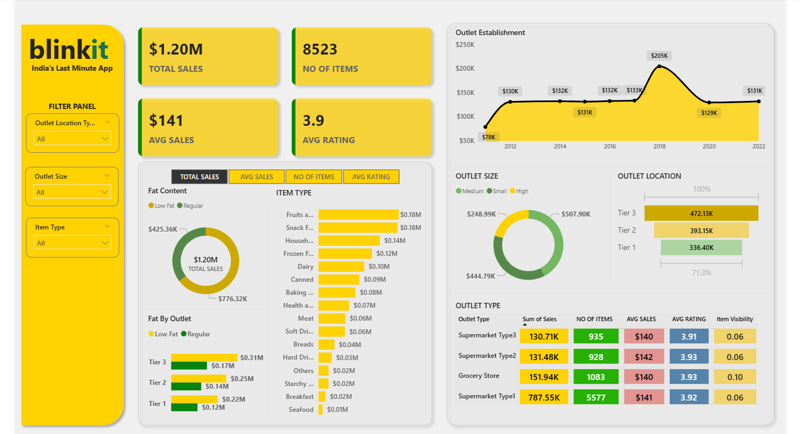

# blinkit-dashboard
Power BI dashboard to analyze Blinkit delivery performance and business KPIs.

# 🚴 Blinkit Power BI Dashboard

This Power BI dashboard analyzes the business performance of **Blinkit**, a hyperlocal delivery platform, focusing on delivery metrics, revenue KPIs, order trends, and customer behavior.

---

## 📊 Dashboard Highlights

- 📦 Total & Average Sales
- 🕒 Avg. Delivery Time & Delays by Region
- 💸 Revenue Trends
- 📈 Yearly Sales Trend
- 🚚 Delivery Partner Efficiency

---

## 📁 Files Included

| File | Description |
|------|-------------|
| `screenshots - Power Bi Screenshot/Screenshot 2025-07-13 175207.png |

---

## 📷 Screenshots

> 📌 Add these screenshots to the `screenshots/` folder before uploading

*Overall Performance Summary*

---

## 🛠 Tools Used

- Microsoft Power BI
- DAX for calculated measures
- Excel/CSV for data transformation

---

## 🚨 Disclaimer

This project is based on fictional or anonymized data and is built for learning purposes. No real user data is exposed.

---

## 📬 Contact

**Souvik Ghorui**  
Aspiring Data Analyst | Interested in Financial & Market Analytics  
[LinkedIn](https://www.linkedin.com/in/souvik-ghorui273/) | [GitHub](https://github.com/Souvik2730)
